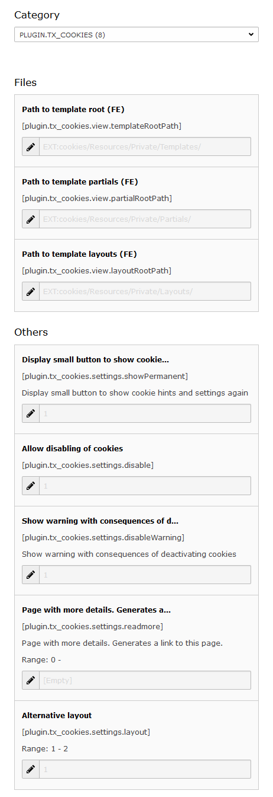

=============
Documentation
=============

----------------
What does it do?
----------------

- Show a hint that cookies are used on your website.
- Hint can be closed or permanently hidden.
- "Read more" link (optional, links to a page where the visitor can find more informations about cookies)
- User has the possibility to disable cookies (optional, if enabled by TYPO3 integrator). Then, all cookies are deleted and a small button is displayed for enabling cookies again.
- Widget can be added as plugin in one page or with TypoScript on every page.
- Provides a cached plugin.
- Fluid template. You can modify anything!
- Uses jQuery.
- Fallback for browsers with disabled JavaScript.

What does it not do?
====================

It doesn't provide an easy way to show a cookie hint. If you want an easy way, you should have a look at https://cookieconsent.insites.com.
Use this extension if you want a flexible solution (you have different settings and you can overwrite HTML and JavaScript), without loading third-party scripts and with the possibility to disable cookies.

-----------
Screenshots
-----------

    Widget on top of the page, simple.

.. figure:: Documentation/screenshot2.png

    Widget on top of the page, with possibility to disable cookies.

    Widget on top of the page, alternative layout, with possibility to disable cookies.

    Plugin settings.

-----
Hints
-----

If you have a login on your page, the login is possible because **this extension does not prevent the creation of new cookies**. In this case, you should write a hint that a cookie is created when logging in.
If you use analytic tools or other extensions, which create cookies, these cookies are still created if you do not prevent his. See chapter "TypoScript condition" for details how you can prevent this.

------------
Installation
------------

After installing this extension you have to add the template "Cookie Control (cookies)" in field "Include static (from extensions)".
Don't forget to include jQuery library!
Add the plugin "Cookies" to a page (e.g. the start page) or on every page with TypoScript:

::

    page.5 < tt_content.list.20.cookies_main

-------------
Configuration
-------------

TS Constants
============

Your configuration options:

    Configuration in constant editor.

Change the text which is shown in the widget
============================================

You can change the text in TypoScript:

::

    plugin.tx_cookies._LOCAL_LANG.en {
        cookie.close = Your text
        cookie.heading = Your text
    }

TypoScript condition
====================

If the user has selected "deactivate cookies", you should deactivate analytic tools like Google Analytics or Piwik, because these tools create new cookies. This is possible with a TypoScript condition:

::

    page.10 = [Google Analytics Tracking Code]
    [globalVar = _COOKIE|tx_cookies_disabled = 1]
    page.10 >
    [end]

Cached version of plugin
========================

By default, the cookie plugin is uncached (USER_INT). That is neccessary to not render the plugin if the user has already closed the cookie hint.
Sometimes, it might be better to use a cached plugin, e.g. for performance reasons or when using extensions like "staticfilecache".
You have the possibility to use the cached plugin by selecting it in the plugin settings or with TypoScript:

::

    page.20 < tt_content.list.20.cookies_main
    page.20.switchableControllerActions.Main.1 = cookieCached

But then, you have to hide the cookie hint by your own, e.g. by a TypoScript condition...

::

    [globalVar = _COOKIE|tx_cookies_accepted = 1]
    page.20 >
    [end]

...or JavaScript:

::

    /**
     * @see http://stackoverflow.com/questions/5639346/what-is-the-shortest-function-for-reading-a-cookie-by-name-in-javascript
     *
     * @param k: name of cookie
     * @returns value of cookie
     */
    function getCookieValue(k) {
        var b = document.cookie.match('(^|;)\\s*' + k + '\\s*=\\s*([^;]+)');
        return b ? b.pop() : '';
    }
    if(getCookieValue('tx_cookies_accepted')) {
        document.getElementById('tx_cookies').style.display = 'none';
    }

If you provide the possibility to disable cookies, you also have to include the following TypoScript setup on the process page (plugin.tx_cookies.pidProcess). Otherwise the cookies will not be disabled.

::

    page.20.switchableControllerActions >

Show cookie widget only in specifiy countries/languages
=======================================================

Use this TypoScript condition:

::

    [globalVar = GP:L = 1]
    page.5 < tt_content.list.20.cookies_main
    [end]

Set cookies after opt-in
========================

To enable cookies only after the user has accepted them, you have to disable all analytics tools and other stuff until there's the cookie "tx_cookies_accepted":

::

    [globalVar = _COOKIE|tx_cookies_accepted = 1]
    page.10 = [Google Analytics Tracking Code]
    [end]

Best use these settings:

::

    plugin.tx_cookies.settings {
        # Permanently show cookie hint, so user can enable cookies again
        showPermanent = 1
        # Allow disabling of cookies: Not needed, because cookies are disabled by default
        disable = 0
        # Show warning with consequences when deactivating cookies
        disableWarning = 1
        # For browsers without JavaScript, the cookie hint is processed on this page. It's highly recommended to set this page, else EXT:realurl generates many entries for speaking urls and you could get problems with cHash.
        pidProcess = 1
    }

----------
To-Do list
----------

You have ideas? Contact me!

---------
ChangeLog
---------

See file **ChangeLog** in the extension directory.